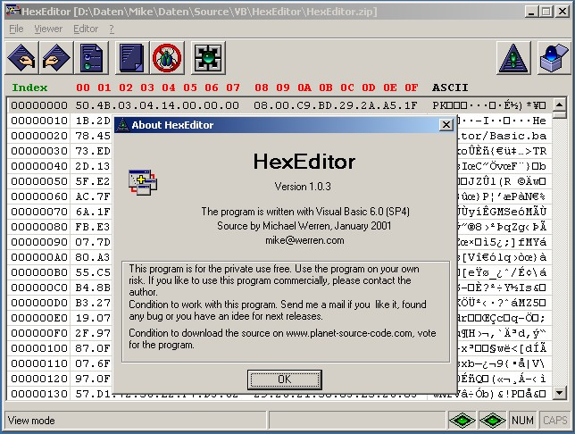



## HexEditor Version 1\.0\.3

### Description

This is a full HexEditor with search function. The code is speed optimized. If you find any bugs or if you have an idea for new features then send me an email. I spent a few hours to build a free application for you therefore please rate / vote for this code
 
### More Info
 

             |
---                |---
**Submitted On**   |2001-01-09 23:52:16
**By**             |[Michael Werren](https://github.com/Planet-Source-Code/PSCIndex/blob/master/ByAuthor/michael-werren.md)
**Level**          |Advanced
**User Rating**    |4.4 (74 globes from 17 users)
**Compatibility**  |VB 6\.0
**Category**       |[Complete Applications](https://github.com/Planet-Source-Code/PSCIndex/blob/master/ByCategory/complete-applications__1-27.md)
**World**          |[Visual Basic](https://github.com/Planet-Source-Code/PSCIndex/blob/master/ByWorld/visual-basic.md)
**Archive File**   |[CODE\_UPLOAD13588192001\.zip](https://github.com/Planet-Source-Code/michael-werren-hexeditor-version-1-0-3__1-14286/archive/master.zip)

